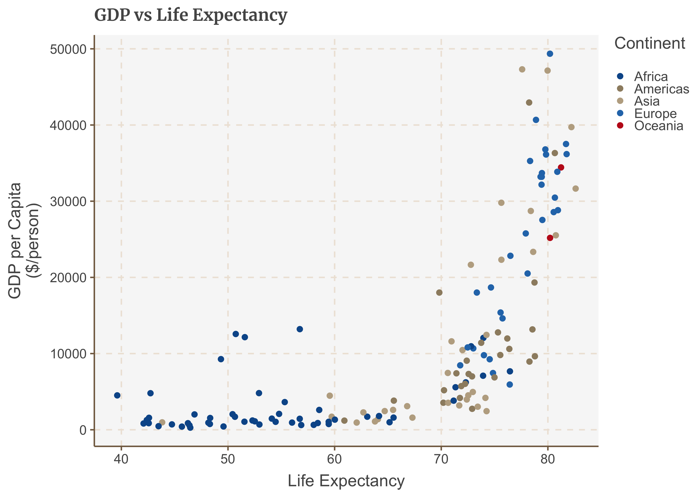
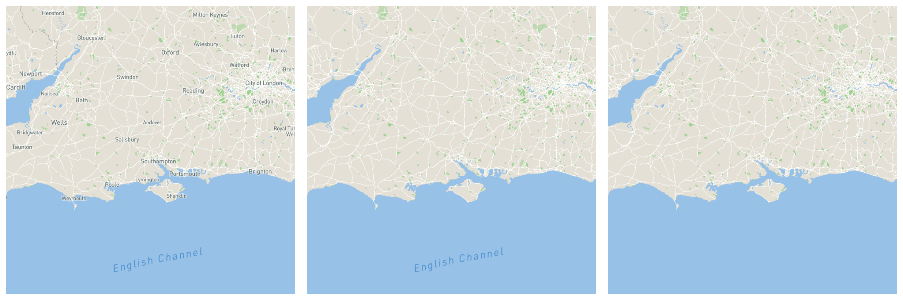

<!-- badges: start -->

<!-- badges: end -->

[](https://www.gnu.org/licenses/gpl-3.0)

<!-- README.md is generated from README.Rmd. Please edit that file -->

# Overview

`FlowmindeR` is a package used for helping produce consistent graphical
outputs for Flowminder work in line with branding guidance. It provides
sets of themes and helper functions in three categories:

  - **Plots**: A ggplot style for producing Flowminder graphics for
    producing graphs in `ggplot`
  - **Documents**: Templates to produce PDF and HTML documents through R
    Markdown
  - **Maps**: Convenient links to use Flowminder themed from Mapbox

## Installation

`FlowmindeR` is not on CRAN, so you will have to install it directly
from Github using `remotes`. If you do not have the `remotes` package
installed, you will have to run the first line in the code below as
well.

``` r
# install.packages('remotes')
remotes::install_github('Flowminder/FlowmindeR')
```

### Plotting

The package helps set a default theme for ggplot graphics. This is set
globally for all your analysis through the `set_fm_style()` function,
which has no arguments and used to set the default ggplot themes. This
sets text size, font and colour, axis lines, axis text and many other
standard chart components into the Flowminder style.

Example of how it is used in a standard workflow:

``` r
library(ggplot2)
library(gapminder) # Used as example data
library(tidyverse)
#> ── Attaching packages ────────────────────────────────────────────────────────────────────────────────────────────────────────────── tidyverse 1.3.0 ──
#> ✓ tibble  3.0.3     ✓ dplyr   1.0.0
#> ✓ tidyr   1.1.0     ✓ stringr 1.4.0
#> ✓ readr   1.3.1     ✓ forcats 0.5.0
#> ✓ purrr   0.3.4
#> ── Conflicts ───────────────────────────────────────────────────────────────────────────────────────────────────────────────── tidyverse_conflicts() ──
#> x dplyr::filter() masks stats::filter()
#> x dplyr::lag()    masks stats::lag()

# Set the defaults
set_fm_style()

gapminder_2007 <- 
  gapminder %>%
  filter(year == 2007)

ggplot(gapminder_2007, aes(x = lifeExp, y = gdpPercap, colour = continent)) +
  geom_point() +
  labs(x= "Life Expectancy", 
       colour = "Continent",
       y = "GDP per Capita\n($/person)",
       title = "GDP vs Life Expectancy")
```

<!-- -->

The function is pretty basic and does not change or adapt based on the
type of chart you are making, so in some cases you will need to make
additional `theme` arguments in your ggplot chain if you want to make
any additions or changes to the style, for example to add or remove
gridlines etc. Detailed examples on how to use the functions included
within the `FlowmindeR` package to produce graphics are included in the
[full vignettes](articles/graphics.html), as well as a more general
reference manual for working with `ggplot2`.

### R Markdown Templates

R Markdown provides a tool which enables you to combine code and written
text, much like Jupyter notebooks. However, the power of R Markdown is
that it offers much greater flexibility in how the outputted document
can be formatted. As such, it is possible to produce fully branded and
functioning PDFs and HTML reports directly from your analysis.


The package contains two functions which can be used: `fm_pdf` and
`fm_html`, which can be used in the `output` within the document’s YAML
settings:

``` yaml
---
title: "My document"
output: FlowmindeR::fm_pdf: default
---
```

For more information, see the [vignette explaining R
Markdown](articles/rmarkdown.html)

### Basemaps

The app offers convenient functions to access custom Mapbox basemaps for
plots through the `fm_mapbox_styles` function. Note, you will have to
register with MapBox to get an access key for this functionality to
work. For details, refer to the [vignette explaining
maps](articles/maps.html)

<!-- -->
